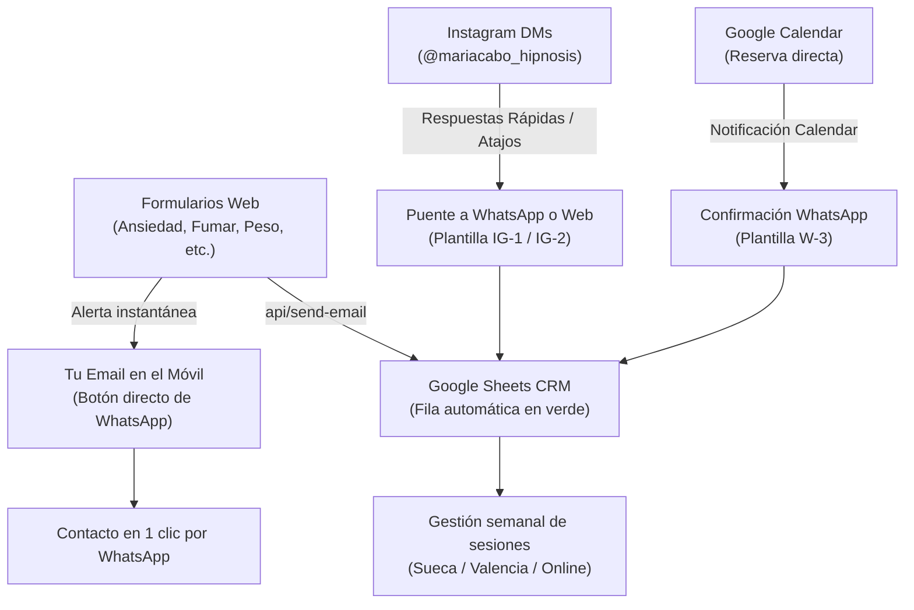

# Manual Operativo: Sistema de Gestión de Leads, Agenda y Vida Personal para María Cabo

Este manual establece tu **Centro de Control Unificado (Solo CRM)** para gestionar todos tus canales de captación (Web, Google Calendar, Instagram y WhatsApp) con el mínimo esfuerzo, máxima conversión y protegiendo tu tiempo y descanso personal.

---

## 1. La Arquitectura de tus 4 Canales (Funnels)

---

## 2. Tu Google Sheets CRM (Pestaña "Leads")

Cada vez que una persona envía un formulario en cualquiera de las páginas de tu web, el sistema añade automáticamente una fila a tu Google Sheet con los datos estructurados.

### Estructura de las 12 Columnas:

| Columna | Nombre                | Tipo                | Descripción                                                                      |
| ------- | --------------------- | ------------------- | -------------------------------------------------------------------------------- |
| **A**   | **Fecha y Hora**      | Automático          | Fecha y hora en horario de España (ej. `02/10/2026 10:30`).                      |
| **B**   | **Estado**            | Menú Desplegable    | Control del pipeline (ver colores abajo).                                        |
| **C**   | **Canal / Origen**    | Automático / Manual | `Web - Ansiedad`, `Web - Antitabaco`, `Web - Peso`, `Instagram DM`, etc.         |
| **D**   | **Nombre**            | Texto               | Nombre del cliente.                                                              |
| **E**   | **Teléfono**          | Texto               | Teléfono facilitado.                                                             |
| **F**   | **Abrir WhatsApp**    | Enlace Interactivo  | Enlace directo: al hacer clic, abre el chat de WhatsApp sin guardar el contacto. |
| **G**   | **Email**             | Texto               | Correo electrónico del cliente.                                                  |
| **H**   | **Modalidad**         | Texto               | `Presencial Sueca`, `A domicilio Valencia` u `Online`.                           |
| **I**   | **Motivo / Síntomas** | Texto               | Síntomas clave o situación que describió.                                        |
| **J**   | **Mensaje / Notas**   | Texto               | Texto completo recibido o tus apuntes privados.                                  |
| **K**   | **Próxima Acción**    | Texto               | Ej. _Llamar martes 11h_, _Esperando respuesta_, _Enviar recordatorio_.           |
| **L**   | **Historial / Pagos** | Texto               | Ej. _Sesión 1 realizada (70 € pagado)_, _Bono Antitabaco 300 €_.                 |

### Los 6 Estados del Lead (Colores en Google Sheets):

1. **🟢 Nuevo**: Lead recién entrado. Aún no le has escrito ni llamado.
2. **🟡 Contactado**: Le has enviado un mensaje por WhatsApp o email y estás a la espera de respuesta.
3. **📅 Cita Agendada**: Ya tiene fecha y hora en tu Google Calendar.
4. **💬 En Seguimiento**: Mostró interés pero pidió hablar más adelante o tiene dudas.
5. **✅ Cliente Activo**: Ya ha hecho su primera sesión y sigue su proceso contigo.
6. **⚪ Cerrado / No Interesado**: Se resolvió su duda, no encajaba o decidió no empezar.

> [!TIP]
> **Configurar los colores en 1 minuto en Google Sheets**:
> Selecciona la Columna B -> Clic en **Datos** -> **Validación de datos** -> Añadir regla -> Criterio: **Menú desplegable**. Escribe las 6 opciones anteriores y asígnales color (verde, amarillo, azul, gris, etc.). ¡Así de un vistazo sabrás exactamente cuántos clientes nuevos tienes pendientes!

---

## 3. Protocolo de Instagram (@mariacabo_hipnosis)

Instagram es excelente para generar confianza y visibilidad, pero puede ser una trampa que absorbe horas si intentas redactar explicaciones largas o hacer terapia por mensaje directo.

### Regla de Oro de Instagram:

> **En Instagram solo validas en 2 frases y rediriges a WhatsApp o al Calendario.**

### Configuración de Respuestas Rápidas (Saved Replies en la App de Instagram):

En la app de Instagram de tu móvil: ve a cualquier mensaje directo -> toca el icono de menú de texto / **Respuestas guardadas** (o Ajustes -> Creador -> Respuestas guardadas) y crea estos 3 atajos:

#### 1. Atajo `/precio` (Cuando preguntan precio o información básica):

> _"¡Hola [Nombre]! Gracias por escribir. Las sesiones individuales son de 1 hora y tienen un coste de 70 € (pueden ser presenciales en mi despacho de Sueca, a domicilio en Valencia ciudad o en formato online). En este enlace tienes toda la información de cómo trabajamos: mariacabo.com/sesiones. Si me cuentas brevemente qué te gustaría mejorar o prefieres que lo comentemos por WhatsApp, dime tu número y te escribo con total tranquilidad. Un abrazo, María."_

#### 2. Atajo `/tema` (Cuando cuentan un problema: ansiedad, peso, uñas, miedos...):

> _"¡Hola [Nombre]! Te entiendo perfectamente, es una situación muy habitual y precisamente con hipnosis podemos trabajar ese patrón automático para que no dependa solo de la fuerza de voluntad. En la web tengo una página donde explico cómo abordamos este tema: mariacabo.com/ambitos. Si quieres que valoremos tu caso juntas en una breve llamada de 10 min sin compromiso, escríbeme al WhatsApp o déjame tu teléfono y buscamos un hueco. Un abrazo."_

#### 3. Atajo `/agendar` (Cuando quieren reservar ya):

> _"¡Qué bien, [Nombre]! Puedes elegir el día y hora que mejor te venga directamente en mi calendario online aquí: [Tu enlace de Google Calendar]. Si tienes cualquier duda antes de reservar, escríbeme por aquí o por WhatsApp y lo vemos. ¡Nos vemos pronto!"_

---

## 4. Plantillas de WhatsApp Listas para Usar

Cuando recibes la alerta de un lead o haces clic en **"💬 Abrir WhatsApp"** en tu hoja de cálculo, copia y pega estas plantillas:

### Plantilla W-1: Primer contacto tras formulario web (Ansiedad, Peso, Hábitos, Fobias...)

> _"Hola [Nombre], soy María Cabo. He recibido tu mensaje a través de la web sobre [tema: ej. la ansiedad / el control de peso / dejar de morderte las uñas]. Quería agradecerte la confianza al escribirme._  
> _Comentabas que te interesaba la modalidad [Presencial en Sueca / Domicilio / Online]. ¿Tienes unos minutos hoy o mañana para que me cuentes brevemente por aquí o en una breve llamada cómo te está afectando y ver si la hipnosis es adecuada para ti? Quedo a tu disposición."_

### Plantilla W-2: Programa para Dejar de Fumar (Entrevista de 20 min)

> _"Hola [Nombre], soy María Cabo. He recibido tu solicitud para el programa para dejar de fumar con hipnosis._  
> _Como comentamos en la web, el primer paso es una breve entrevista previa gratuita de 20 minutos (por teléfono o videollamada) para conocer tu historial con el tabaco y asegurarnos de que el programa encaja contigo. ¿Qué horario sueles tener más disponible, por las mañanas o por las tardes? Un abrazo."_

### Plantilla W-3: Confirmación de Cita Agendada en Google Calendar

> _"Hola [Nombre], ¡cita confirmada! Te escribo para confirmar que tenemos nuestra sesión de hipnosis el próximo [Día] a las [Hora] en [Despacho Centro Sanar en Sueca / Tu domicilio en Valencia / Enlace de Videollamada]._  
> _No necesitas preparar nada especial, solo venir con ropa cómoda y ganas de trabajar con tranquilidad. Si surge cualquier imprevisto, por favor avísame con al menos 24 horas de antelación. ¡Nos vemos ese día!"_

### Plantilla W-4: Seguimiento respetuoso a las 48h (si no respondieron)

> _"Hola [Nombre], simplemente te escribía para ver si pudiste leer mi mensaje anterior. Sin ningún compromiso, solo por saber si sigues queriendo valorar el acompañamiento o si prefieres dejarlo para más adelante. ¡Que tengas muy buen día!"_

---

## 5. El Sistema de Protección de tu Vida Personal (Time-Blocking)

Al ser una sola persona, tu salud mental y energía determinan el éxito de tu consulta. La disponibilidad 24/7 es el camino más rápido al agotamiento.

### La Regla de las "Dos Ventanas Diarias de Leads":

1. **Ventana Mañana (09:15 - 09:45)**:
   - Revisas tu Google Sheet.
   - Respondes los leads nuevos de la web por WhatsApp.
   - Despachas los 2-3 DMs de Instagram con las respuestas rápidas.
   - Cambias los estados de `🟢 Nuevo` a `🟡 Contactado`.
2. **Ventana Tarde (19:15 - 19:35)**:
   - Envías confirmaciones de citas para el día siguiente.
   - Respondes últimos mensajes de clientes activos.
   - Cierras la pantalla y desconectas.

### Bloqueo de Días por Ubicación (Evitar desplazamientos innecesarios):

- **Lunes y Miércoles**: **Despacho en Sueca (Centro Sanar)** + Huecos Online.
- **Martes y Jueves**: **Sesiones a Domicilio en Valencia** (agrupando clientes por la mañana o tarde en la misma zona).
- **Viernes**: Sesiones Online + Formación / Contenido de Instagram / Vida personal.
- **Sábados y Domingos**: Desconexión total. Si entra un lead en la web o Instagram el sábado por la tarde, lo atiendes el lunes a las 09:15. Los clientes respetan y valoran enormemente a un profesional con límites saludables.

---

## 6. Checklist Diario de 5 Minutos

- [ ] **09:15** Abrir Google Sheets -> ¿Hay filas en 🟢? -> Tocar "Abrir WhatsApp" y enviar Plantilla W-1 -> Cambiar a 🟡.
- [ ] **09:35** Abrir Instagram -> Contestar DMs con atajo `/precio` o `/tema` -> Redirigir a WhatsApp.
- [ ] **Resto del día**: Modo atención a pacientes y presencia personal (notificaciones silenciadas).
- [ ] **19:15** Revisar Google Calendar de mañana -> Enviar recordatorio a las citas del día siguiente.
